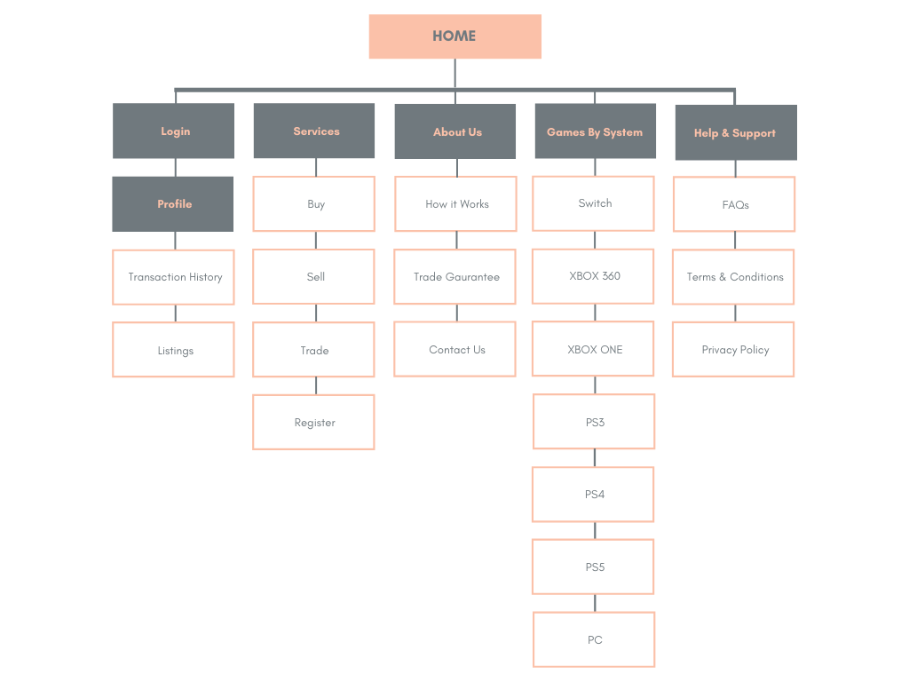

# GamersTrade


## Overview

GamersTrade is an application that allows users to buy, sell, or trade games and consoles from other users. Users of the platform have the ability to post the game(s) or console(s) they would like to sell, trade, or buy. If they wish, potential buyers or traders can privately communicate with the seller or traders to negotiate on the price or deal. To utilize this platform, the user must create an account to conduct any transaction.

* **Sell**: Users are given the ability to post the items that they wish to sell on the platform and set a fixed price on the item and state the condition (old, good, new, etc.) the item is in.

* **Buy**: Users who will be able to buy any available item that they are interested in and can contact the buyer if they wish to negotiate on the price. They can also browse for games based on genre, price, console, or condition as well as browse through consoles and accessories. 

* **Trade**: Users will be given the ability to trade games with potential traders that have posted games for trade and can contact the trader if they wish to negotiate on the deal. They can browse for games based on genre, price, console, or condition as well as browse through consoles and accessories. 


## Getting Started
In the project directory(client), you can run:

### `npm start`

Runs the app in the development mode.<br />
Open [http://localhost:3000](http://localhost:3000) to view it in the browser.

The page will reload if you make edits.<br />
You will also see any lint errors in the console.

**More information can be found in the .readme files located in the following client and server directories**

## Requirements

1. [Python 3](https://www.python.org/downloads/)
2. [MySQL](https://www.mysql.com/downloads/)
3. requirements.txt file is provided for modules/libraries needed

## Data Model

(___TODO__: A description of your application's data and their relationships to each other_)

The application will store user, profile, listings and transactions.

- User contains basic information about user.
- Profiles contain more information about user.
- Listings are individual game listings posted by users.
- Transactions keep track of listings that have been purchased or traded.

(___TODO__: Sample resources_)

An Example `User`:

```javascript
{
  userId: 5,
  userName: "MaryJane",
  password: "JanesPassword123"
  email: "maryjanedoe123@fakeemail.com
  verified: 1
  registrationDate: '2020-12-25 12:00:00'
}
```

An Example `Profile`:

```javascript
{
  profileId: 3,
  firstName: "Mary"
  lastName: "Jane"
  phoneNumber: "555-555-5555"
  city: "Manhattan"
  state: "New York"
  country: "United States"
  name: "Lamp",
  price: "$19.99"
  zipcode: 10100
  userId: 5 // Reference to User table
}
```

An Example `Listing`:

```javascript
{
  listingId: 1,
  userId: 5 // Reference to User table
  gameId: 25 // Reference to game API
  price: 25.99
  condition: "NEW"
  additionalNotes: "Never opened before"
  buyOrTrade: "buy"
  sold: false
}
```

An Example `Transaction`:

```javascript
{
  transactionId: 1
  listingId: 1 // Reference to Listings table
  sellerId: 10 // Reference to User table
  buyerId: 5 // Reference to User table
  price: 35.99
  transactionDate: '2020-12-25 12:01:00
}
```

## Site map



## User Stories or Use Cases

1. As a user, I want to be able to negotiate prices with other sellers. 
2. As a user, I want to be able to search for items based on my interests.
3. As a user, I want to be able to register and log in.
4. As a user, I want to be able to sell my items to other users.
5. As a user, I want to be able to trade games with other users.
6. As a user, I want to communicate with sellers and traders privately.
7. As a user, I want to be able to post the games I want to sell.
8. As a user, I want to be able to post the games I want to trade.
9. As a user, I want to be able to buy items from other users. 

## References Used

1. [React Bootstrap](https://react-bootstrap.netlify.app/getting-started/introduction/)
2. [Eddie's Project From Other Course](https://github.com/The-Sciences-and-Engineering-Squad/Marketext)

## Authors

Eddie Ozuna\
Kevin Alvarez\
Sandy Qiu\
Moshe Oppenheim
